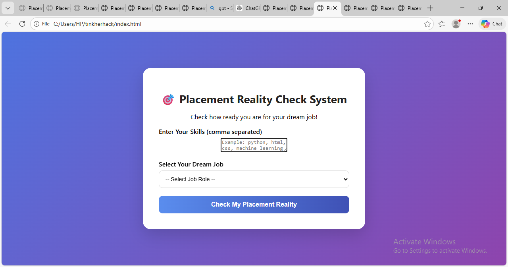

example:<p align="center">
  
</p>

# Placement Reality Check System 🎯

## Basic Details

### Team Name:
Sreeyuktha (Individual Participant)

### Team Members
- Sreeyuktha - [Your College Name]

### Hosted Project Link
https://sreeeyuktha.github.io/placement-reality-check2/

---

## Project Description

Placement Reality Check System is a web-based application designed to evaluate a student's readiness for their dream job.  
It compares user-entered skills with predefined job role requirements and identifies matched and missing skills.  
The system generates a readiness score along with personalized feedback to help students strategically improve their placement preparation.

---

## The Problem Statement

Many students apply for placements without clearly understanding whether their skills match industry requirements.  
This lack of awareness about skill gaps reduces their chances of getting selected.  
Students need a simple and accessible system that evaluates their skills and provides clear insights into their job readiness.

---

## The Solution

The Placement Reality Check System provides an interactive platform where users can enter their skills and select a desired job role.  
The system analyzes the entered skills against predefined job requirements and highlights matched and missing skills.  
It then calculates a placement readiness score and provides feedback to help students focus on improving the right areas.

---

# Technical Details

## Technologies/Components Used

### For Software:

- **Languages used:** HTML, CSS, JavaScript  
- **Frameworks used:** None (Vanilla JavaScript)  
- **Libraries used:** None  
- **Tools used:** VS Code, Git, GitHub, Web Browser  

### For Hardware:

- **Main components:** Laptop/Desktop Computer  
- **Specifications:** Minimum 4GB RAM, Modern Web Browser (Chrome, Edge, Firefox)  
- **Tools required:** Internet connection, Code editor  

---

## Features

- **Feature 1: Skill Input System**  
  Users can enter their technical skills in a simple comma-separated format.

- **Feature 2: Job Role Selection**  
  Users can choose their desired job role from a predefined list.

- **Feature 3: Skill Matching Analysis**  
  The system compares user skills with required job skills and identifies matched and missing skills.

- **Feature 4: Readiness Score & Feedback**  
  Generates a placement readiness score along with improvement suggestions.

- **Feature 5: Clean & Interactive UI**  
  Modern user interface with responsive design for better user experience.

---

# Implementation

## For Software:

### Installation

No special installation is required since this is a static web project.

```bash
# Clone the repository
git clone https://github.com/sreeeyuktha/placement-reality-check2.git

# Navigate into the project folder
cd placement-reality-check2
```

No additional dependencies are required.

---

### Run

You can run the project using any of the following methods:

**Method 1: Directly Open**
```bash
# Open index.html in your web browser
```

**Method 2: Using Live Server (Recommended)**
```bash
# Install Live Server extension in VS Code
# Right-click index.html → Open with Live Server
```

---

## For Hardware:

### Components Required

- Laptop or Desktop Computer  
- Minimum 4GB RAM  
- Modern Web Browser (Chrome/Edge/Firefox)  
- Stable Internet Connection (for hosting or GitHub Pages deployment)

### Circuit Setup

Not applicable.  
This project is purely software-based and does not require any hardware circuit setup.


## Project Documentation

### For Software:

#### Screenshots (Add at least 3)


a simble system that tells students the real probability of getting placed based on their skills,preparation level,and market demand instead of hype

Here the applicant can give information about his skills and choose his dream job position. So through this process he can check his placement reality.


a simble system that tells students the real probability of getting placed based on their skills,preparation level,and market demand instead of hype


#### Diagrams

**System Architecture:**


*Explain your system architecture - components, data flow, tech stack interaction*

**Application Workflow:**


*Add caption explaining your workflow*

---

### For Hardware Projects (Software-Only Adaptation):

#### Bill of Materials (BOM)

| Component / Tool | Quantity | Specifications | Price | Link/Source |
|-----------------|----------|----------------|-------|-------------|
| Laptop / Desktop | 1 | Minimum 4GB RAM, Modern Browser | ₹20,000+ | Personal / Any |
| Web Browser | 1 | Chrome, Edge, Firefox | Free | [https://www.google.com/chrome/](https://www.google.com/chrome/) |
| Code Editor | 1 | VS Code | Free | [https://code.visualstudio.com/](https://code.visualstudio.com/) |
| Git & GitHub | 1 | Version control | Free | [https://github.com/](https://github.com/) |
| Internet Connection | 1 | Stable broadband / Wi-Fi | ₹500+ per month | Local ISP |
| [Optional] Live Server Extension | 1 | VS Code extension for live preview | Free | [https://marketplace.visualstudio.com/items?itemName=ritwickdey.LiveServer](https://marketplace.visualstudio.com/items?itemName=ritwickdey.LiveServer) |


**Common License Options:**
- MIT License (Permissive, widely used)
- Apache 2.0 (Permissive with patent grant)
- GPL v3 


Made with ❤️ at TinkerHub
